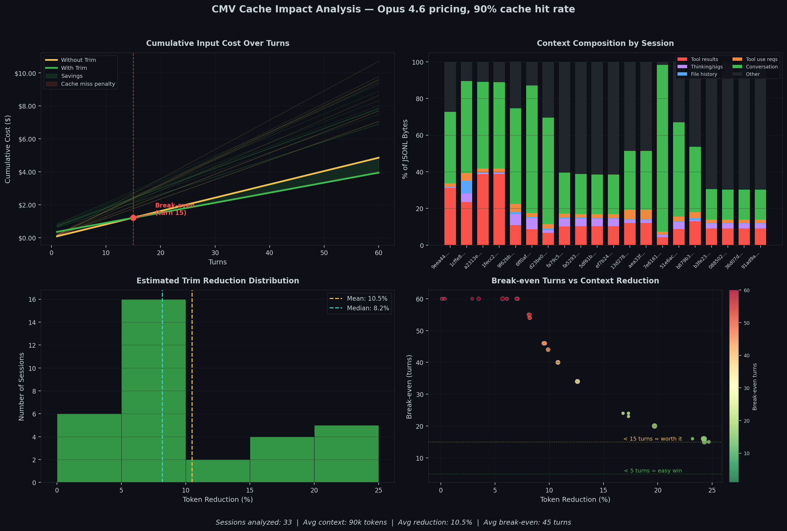

# CMV Cache Impact Analysis

## Context

CMV's `trim` feature reduces context window usage by stripping mechanical overhead (tool results, image blocks, tool_use inputs, thinking block signatures, file-history snapshots, queue operations, orphaned tool results, and pre-compaction dead lines) from Claude Code session data. A natural question arose during community discussion: **does trimming invalidate prompt caching in a way that increases costs?**

This document presents empirical data from **76 real Claude Code sessions** using the **actual v2.0 trimmer** (not estimations) to answer that question.

---

## TL;DR

- **Most Claude Code users pay a flat subscription** (Pro $20/mo, Max $100-200/mo). For them, per-token costs don't apply — **trimming is purely a context window optimization with no cost implications.**
- **For API-key users**, trimming causes a one-time cache miss costing $0.01-0.49 for typical sessions. For tool-heavy sessions (mixed bloat profile), break-even occurs within **3-10 turns**. For conversational sessions with minimal overhead, break-even extends beyond 30 turns, correctly indicating that trimming is unnecessary. **Over any session with meaningful tool usage, trimming is cost-neutral to cost-positive.**
- **Trimming in CMV is only available during snapshotting**, which creates a new branch for a different task. **This reduces the likelihood that stripped tool results would have been needed downstream.**
- **Open question**: whether stripping tool results affects response quality on the new branch. **This analysis covers cost only.** Quality impact measurement is planned. However, from qualitative results the author has yet to note meaningful degradation across snapshot trimmed tasks.

---

## Background

Claude Code sends the full conversation history as input tokens on every API call. Over a long session, this context accumulates mechanical overhead:

- **Tool results** — full file contents, grep output, command results (often 5-50k chars each)
- **Image blocks** — base64-encoded screenshots and diagrams inside tool results (50-200KB each)
- **Tool_use inputs** — Write/Edit tool calls contain the full file being written (often 5-20k chars)
- **Thinking block signatures** — cryptographic signatures on every thinking block
- **File-history snapshots** — periodic dumps of working directory state
- **Queue operations** — internal scheduling metadata
- **Pre-compaction dead lines** — JSONL lines before the last compaction boundary, no longer in active context
- **Orphaned tool results** — tool_result blocks whose matching tool_use was discarded by compaction

CMV's `trim` feature removes this overhead when creating a snapshot/branch, reducing the token count sent to the API. Because Anthropic uses [prompt caching](https://docs.anthropic.com/en/docs/build-with-claude/prompt-caching), trimming changes the prompt prefix and causes a cache miss on the first subsequent turn. Since cache writes cost 1.25x base price while cache reads cost 0.1x, this miss introduces a one-time cost penalty.

The question is whether subsequent per-turn savings (from caching a smaller prefix) recover that penalty.

---

## Methodology

### Data Collection
- Scanned all Claude Code sessions from `~/.claude/projects/`
- Excluded subagent sessions (internal Claude processes)
- Filtered out sessions with <10 messages or <5,000 tokens
- Excluded currently active sessions
- **76 sessions** qualified for analysis
- All sessions are from a single user (the author). Multi-user data would strengthen these findings — see [Reproduce These Results](#reproduce-these-results) for how to contribute.

### Ground-Truth Trim Analysis (v2.0)

Unlike previous versions of this analysis which estimated reduction using byte-ratio heuristics, this version **runs the actual v2.0 trimmer** on every qualifying session. Each session is trimmed to a temporary file, the real `TrimMetrics` (original bytes, trimmed bytes, items stubbed/stripped/removed) are collected, and the temp file is discarded. This eliminates the ~2x estimation gap observed in v1.0.

The v2.0 trimmer implements a three-pass architecture:
1. **Pass 1**: Compaction boundary detection (cheap string scan, no JSON parsing)
2. **Pass 2**: Pre-boundary tool_use ID collection (for orphan detection)
3. **Pass 3**: Stream-process with trim rules:
   - Pre-compaction content → skipped entirely
   - `file-history-snapshot` → removed entirely
   - `queue-operation` → removed entirely
   - Image blocks → always stripped
   - `tool_result` > 500 chars → stubbed to summary
   - `tool_use` inputs → large fields stubbed (write tools targeted, broad fallback)
   - Thinking blocks → removed entirely (non-portable signatures)
   - Orphaned tool results → stripped (API correctness)
   - API usage metadata → stripped
   - Everything else → preserved verbatim

### Session Classification by Bloat Profile

Sessions are segmented into three tiers based on tool result bytes as a percentage of total JSONL bytes:
- **Tool-heavy (>40%)**: Sessions dominated by file reads, screenshots, and tool output
- **Mixed (15-40%)**: Typical coding sessions with moderate tool use
- **Conversational (<15%)**: Mostly dialogue with few tool calls

### Token Estimation
- Preferred API-reported `usage.input_tokens` from JSONL when available
- Fell back to `content_chars / 4 + 20,000` (system overhead) heuristic
- Respected compaction boundaries (Claude Code's built-in summarization)

### Cost Model

**These per-token costs only apply to API-key users.** Claude Code Pro/Max subscribers pay a flat monthly fee regardless of token usage.

Using [official Anthropic pricing](https://docs.anthropic.com/en/docs/build-with-claude/prompt-caching) (as of February 2026):

| Model | Base Input | Cache Write (1.25x) | Cache Read (0.1x) |
|-------|-----------|--------------------|--------------------|
| Sonnet 4 | $3.00/MTok | $3.75/MTok | $0.30/MTok |
| Opus 4.6 | $5.00/MTok | $6.25/MTok | $0.50/MTok |
| Opus 4/4.1 | $15.00/MTok | $18.75/MTok | $1.50/MTok |
| Haiku 4.5 | $1.00/MTok | $1.25/MTok | $0.10/MTok |

### Cache Hit Rate Assumption

We assume a **90% cache hit rate** in steady state. This is not empirically measured — it is an estimate based on the observation that conversation history is append-only between turns, so most of the prompt prefix remains unchanged. Note that system prompts, tool definitions, and other prefix content can change between turns (e.g. when Claude Code updates its tool list), which would reduce the effective hit rate. The 90% figure is a modelling assumption, not a claim about actual cache behavior.

**Sensitivity**: if the real cache hit rate is lower (e.g. 70%), the absolute cost of a cache miss from trimming is smaller (because baseline costs are already higher from organic misses), and the break-even period shifts only modestly. The directional finding — that trimming recovers its cost over a non-trivial session — holds across reasonable cache hit assumptions (60-95%).

---

## Results

### Overall Results (76 sessions, Sonnet 4 pricing, 90% cache hit)

| Metric | Min | Median | Mean | Max |
|--------|-----|--------|------|-----|
| Token reduction (%) | 0 | 12 | 20 | 86 |
| Cache miss penalty ($) | -0.01 | 0.19 | 0.18 | 0.49 |
| Break-even (turns) | 1 | 38 | 35 | 60 |

For comparison, native autocompaction reduces token count by ~98% — discarding everything. CMV's structurally lossless trim preserves all conversation content while achieving meaningful reduction.

### Results by Bloat Profile

| Bloat Profile | Sessions | Mean Reduction | Median Reduction | Mean Break-even | Mean Context |
|---------------|----------|---------------|-----------------|----------------|-------------|
| Mixed (15-40%) | 12 | 39% | 34% | 10 turns | 97k |
| Conversational (<15%) | 64 | 17% | 10% | 40 turns | 83k |
| **All sessions** | **76** | **20%** | **12%** | **35 turns** | **85k** |

**Key insight**: Sessions with higher tool usage ("mixed" profile) show **3.4x higher reduction** and **4x faster break-even** than conversational sessions. The trimmer is adaptive — it removes what's there to remove and correctly does little when there's minimal overhead.

### Interpretation

**Turn 1 after trim**: All tokens are written fresh at 1.25x base price instead of served from cache at 0.1x. This is the one-time penalty.

**Turn 2+ after trim**: The new (smaller) prefix is cached. Each subsequent turn costs less than it would have without trimming, because cache reads are applied to fewer tokens.

**Break-even**: For mixed-profile sessions (34% median reduction), break-even occurs within 10 turns. For conversational sessions with minimal overhead, break-even extends beyond 30 turns. Even before break-even, the cumulative cost difference is small — on the order of cents.

For sessions with minimal reduction (<5%), trimming offers negligible cost benefit. The `cmv benchmark` command flags these directly.

---

## Charts

### Combined Dashboard (Opus 4.6 Pricing)


### Reading the Charts

**Top-left — Cumulative Cost**: Total input cost over 60 turns. Yellow = no trim, green = with trim. The red dot marks the break-even point. Thin background lines show individual sessions; the thick line highlights the session with the highest bloat.

**Top-right — Context Composition**: Stacked bars showing content breakdown per session. Red (tool results) and orange (tool_use requests) represent trimmable overhead. Green (conversation) is preserved.

**Bottom-left — Reduction Distribution**: Histogram of token reduction per session, color-coded by bloat tier. Mean and median reduction lines are overlaid.

**Bottom-right — Break-even vs Reduction**: Each point is a session, shaped and colored by bloat tier. X-axis = reduction percentage, Y-axis = turns to break-even. Sessions in the lower-right represent the strongest cost-saving candidates.

---

## What This Analysis Does Not Cover

### Response Quality

Trimming removes tool result content that Claude may reference in subsequent turns. If a stripped file listing or command output is needed for downstream reasoning, Claude may hallucinate, ask for a re-read, or produce lower-quality responses.

The mitigating factor: **trimming in CMV only occurs during snapshotting, which creates a new branch.** The intended workflow is to complete a line of work, snapshot, trim, and branch to a different task. The new branch retains the full conversational context (decisions made, approaches discussed) without the raw data dumps. For divergent tasks, this is likely sufficient — but "likely" is not "measured."

The planned approach to close this gap:

- Take snapshots at various conversation depths
- Branch twice from each: one trimmed, one untrimmed
- Give both branches the same follow-up task
- Compare output quality (correctness, hallucination rate, need for file re-reads)
- Identify which categories of tool results carry downstream signal vs. which are safe to strip

Until that work is complete, the quality impact of trimming is an open question.

### Multi-User Variance

All 76 sessions are from a single user and machine. Different coding patterns, project types, tool usage, and session lengths will produce different bloat profiles. We encourage users to run `cmv benchmark --all --json` and share results to build a broader dataset.

---

## When Trimming Is Not Recommended

- **Sessions with <5% reduction**: Minimal overhead to remove
- **Sessions that won't be continued**: No subsequent turns to recover the cache miss cost
- **Very short continuations (<10 turns expected)**: May not reach break-even for modestly bloated sessions
- **Branches that continue the same file-editing task**: If the new branch needs specific tool outputs from the previous context, don't trim

---

## Summary

For subscription users, trimming has no cost implications and serves purely as a context window optimization. For API-key users, trimming introduces a small one-time cache miss penalty that is recovered over continued use of the session. The net cost impact is neutral to positive for any session of non-trivial length.

The primary value of trimming is not cost savings but context window management: reclaiming space within the 200k token limit, delaying lossy auto-compaction, and enabling branching workflows. The effect of trimming on downstream response quality has not yet been measured and is the most important open question for future work.

---

## Reproduce These Results

```bash
# Install CMV
npm install -g cmv

# Run benchmark on your most recent session
cmv benchmark --latest

# Run benchmark on ALL qualifying sessions (ground-truth data)
cmv benchmark --all -m sonnet --out data/benchmark_results.json

# Generate publication-quality charts from the data
pip install matplotlib numpy
python docs/assets/benchmark_analysis.py \
  --input-json data/benchmark_results.json \
  --theme light --individual --stats \
  -m sonnet -o data/cmv_benchmark

# Generate dark-theme combined chart for README
python docs/assets/benchmark_analysis.py \
  --input-json data/benchmark_results.json \
  --theme dark -m opus -o docs/assets/cmv_benchmark_opus
```

### Benchmark Data

The raw per-session benchmark data is saved to `data/benchmark_results.json` and includes comprehensive metrics for each session: token counts, real trim metrics (bytes removed, items stubbed/stripped), cost projections, and content breakdown. This file can be re-plotted with different models, themes, or cache hit rate assumptions without re-running the trimmer.

---

## Source

- Pricing data: [Anthropic Prompt Caching Documentation](https://docs.anthropic.com/en/docs/build-with-claude/prompt-caching)
- Analysis code: [`docs/assets/benchmark_analysis.py`](assets/benchmark_analysis.py)
- Benchmark data: [`data/benchmark_results.json`](../data/benchmark_results.json)
- CMV: [github.com/CosmoNaught/cmv](https://github.com/CosmoNaught/claude-code-cmv)

*Updated February 2026 (v2.0 ground-truth analysis). 76 sessions analyzed with real trimmer. All analysis run against real Claude Code sessions on the author's machine.*
